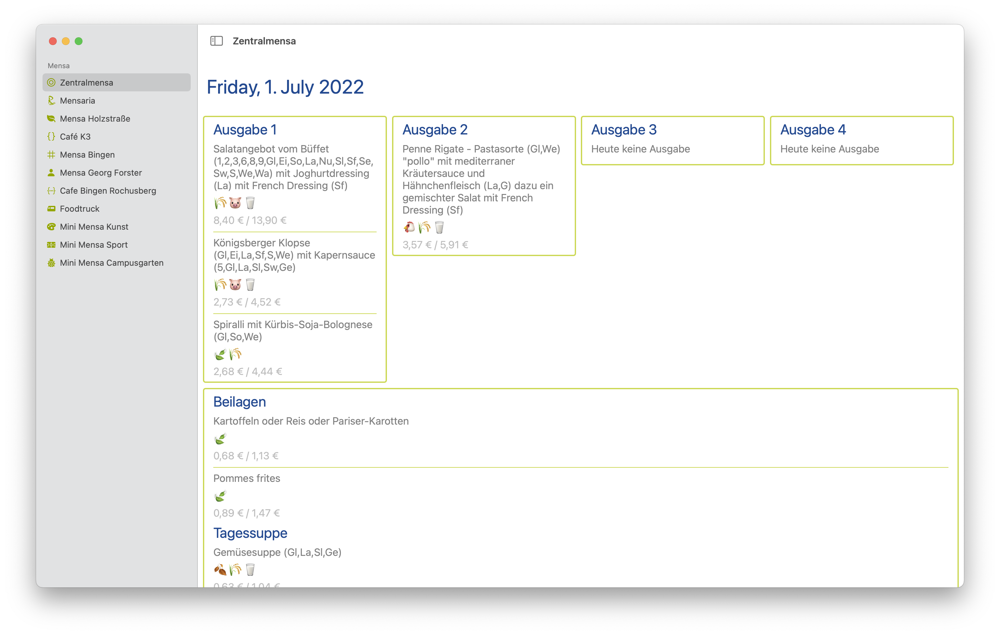

  
  <h2 align="center">Mensa</h2>

This application is only useful if you study or work at the Johannes Gutenberg university of Mainz (JGU). This application shows you the menu for every canteen on the campus. The app is compatible with iPhone, iPad and mac. It includes a widget in different sizes to show you the menu for a specific canteen, counter and even allows you to filter out all none vegan options.

> Warning: I wrote this source code in a day, that means it is hard to read and there are definitely bugs.

### macOS

 

### iPadOS

### iOS

|  |  |
|---|---|

### Widget

|  |  |
|---|---|

